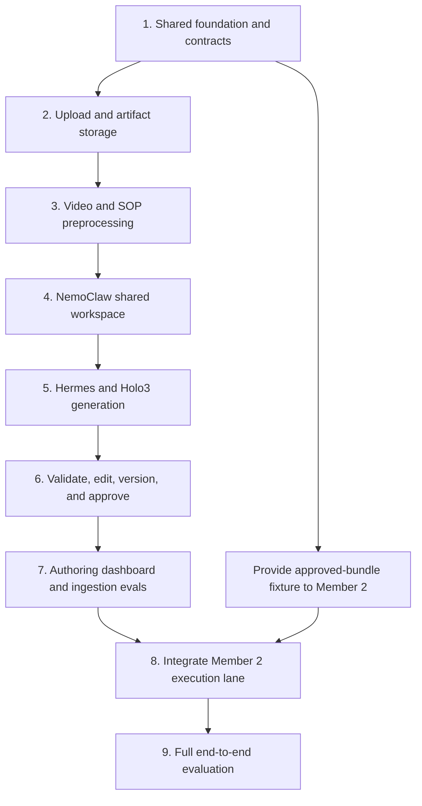

# Member 1 Plan — Ingestion, Authoring, and Integration

## Role and outcome

Member 1 owns the path from uploaded evidence to an approved automation bundle. Member 1 also owns shared contracts, repository-wide configuration, documentation, and final integration.

The lane is complete when a video and/or SOP can be ingested, converted into an editable bundle, validated, approved, and handed to Member 2's execution system through the shared `ApprovedBundle` contract.

## Ownership boundaries

Member 1 exclusively owns:

- shared Pydantic and JSON schemas;
- root dependency and lock files;
- FastAPI and React application entrypoints;
- upload, ingestion, authoring, and bundle-management modules;
- `web/src/features/authoring/`;
- project documentation and final integration;
- the fixed approved-bundle fixture used by Member 2.

Member 1 must not implement Holo execution, the desktop CRM fixtures, the execution state machine, or the execution UI. Those belong to Member 2.

## Order of execution

### 1. Merge the shared foundation

- Create the backend, frontend, desktop-fixture, and test directory structure.
- Define `AutomationManifest`, `ApprovedBundle`, `RunRequest`, `RunEvent`, `StagedChange`, `ApprovalRecord`, and `RunResult`.
- Add one valid, fixed approved-bundle fixture.
- Establish separate FastAPI routers and React feature folders for authoring and execution.
- Merge this work before either member starts feature development.

**Exit condition:** Member 2 can import the contracts and run tests against the fixed bundle without depending on unfinished ingestion code.

### 2. Implement uploads and artifact storage

- Accept named MP4, MOV, WebM, PDF, Markdown, and text sources within the MVP limits.
- Sanitize filenames, validate MIME types and size limits, and reject path traversal.
- Create stable automation IDs and versioned local artifact folders.
- Persist upload, processing, review, approval, and failure states.

**Exit condition:** Valid uploads survive restart and invalid uploads fail without partial bundles.

### 3. Preprocess video and SOP evidence

- Extract timestamped frames and audio from video.
- Transcribe audio through Gradium and retain transcript timestamps.
- Extract normalized text from supported SOP formats.
- Preserve source hashes and evidence references for auditability.

**Exit condition:** A deterministic evidence package exists for video-only, SOP-only, and combined inputs.

### 4. Integrate the NemoClaw shared workspace

- Configure the Hermes sandbox and `/sandbox/workspace` shared mount.
- Stage only the evidence required for ingestion.
- Detect an unavailable or stale mount and fail the job closed.
- Keep originals and provider credentials outside the sandbox.

**Exit condition:** Hermes can read a staged evidence package and write results without gaining arbitrary host access.

### 5. Generate bundles with Hermes and Holo3

- Route the ingestion agent to hosted `holo3-122b-a10b`.
- Generate an app-independent SOP, Holo `SKILL.md`, input schema, checks, pure-data Python tools, tests, and evidence-linked conflicts.
- Prohibit coordinates, selectors, source-app-only instructions, and silent conflict resolution.

**Exit condition:** The agent returns a bundle matching the shared schema for every valid gold fixture.

### 6. Validate, version, edit, and approve

- Validate artifact structure, Holo skill frontmatter, JSON schemas, generated tools, and generated tests.
- Enforce the generated-code import and capability allowlist.
- Invalidate approval whenever an approved artifact changes.
- Publish only the currently approved skill version to the app-owned Holo skill directory.

**Exit condition:** Unapproved, unsafe, invalid, or hash-mismatched bundles cannot run.

### 7. Build the authoring dashboard

- Implement the automation list, creation flow, processing progress, and detail view.
- Provide editors for the SOP, skill, input schema, checks, conflicts, generated code, and tests.
- Expose validation, regenerate, approve, deactivate, and delete actions.

**Exit condition:** An operations expert can reach an approved bundle without editing repository files.

### 8. Add ingestion evals

- Create gold fixtures for video-only, SOP-only, aligned sources, conflicting sources, silent video, and malformed input.
- Measure aggregate critical-step recall and confirmation-boundary recall.
- Add tests for malformed media, unsafe code, source conflict visibility, approval invalidation, and lost mounts.

**Exit condition:** Critical-step recall is at least 90%, confirmation-boundary recall is 100%, and all safety checks pass.

### 9. Perform final integration

- Replace Member 2's fixed bundle fixture with a real approved ingestion result.
- Register Member 2's routers and React route from the shared entrypoints.
- Run the complete upload-to-desktop workflow against both CRM fixtures.
- Record the joint eval results in `docs/EVALS.md`.

**Exit condition:** The full workflow passes the agreed ingestion, voice, approval, and cross-app thresholds.

## Execution flow

## Coordination and merge rules

- Merge the foundation PR before parallel development starts.
- Create a fresh short-lived branch from current `main` for each milestone.
- Member 1 is the only person who edits root dependencies, lock files, shared schemas, app entrypoints, and shared documentation.
- Apply Member 2's dependency or route-registration requests in small dedicated commits.
- Keep the fixed approved-bundle fixture backward compatible during parallel work.
- Rebase each branch on `main` immediately before review.
- Perform cross-lane fixes in a final integration branch instead of changing ownership boundaries.

## Recommended PR sequence

1. `foundation/contracts-and-shell`
2. `authoring/ingestion-backend`
3. `authoring/review-dashboard`
4. `integration/full-workflow`
