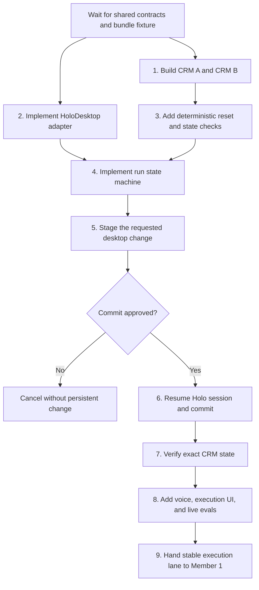

# Member 2 Plan — Desktop Execution and Voice

## Role and outcome

Member 2 owns the path from an approved automation bundle to a safely completed desktop action. This includes the two native mock CRM applications, HoloDesktop execution, the approval state machine, voice triggering, execution UI, and live execution evals.

The lane is complete when the fixed approved-bundle fixture can be launched from the dashboard or voice, stage the correct change without saving, require explicit approval, and update either desktop CRM successfully.

## Ownership boundaries

Member 2 exclusively owns:

- `desktop_fixtures/` and its deterministic reset/state tools;
- desktop execution, Holo adapter, and run-state modules;
- `web/src/features/execution/`;
- voice command handling and execution events;
- execution, voice-routing, approval-safety, and cross-app tests.

Member 2 must not directly edit shared contracts, root dependencies or lock files, application entrypoints, shared styles, or project documentation. Required shared changes must be sent to Member 1 as an explicit integration request.

## Prerequisite

Do not begin execution integration until Member 1 merges the shared contracts and fixed approved-bundle fixture. The two desktop CRM fixtures may be developed earlier if they remain independent of shared application code.

## Order of execution

### 1. Build the two desktop CRM fixtures

- Create two distinct PySide6 desktop applications with different navigation, labels, and layouts.
- Seed equivalent contacts and CRM fields in both applications.
- Make CRM A the taught application and CRM B the zero-shot transfer target.
- Store test state locally without exposing a runtime API to Holo.

**Exit condition:** Both apps launch independently and present the same business operation through visibly different interfaces.

### 2. Add deterministic reset and state inspection

- Provide commands that restore known seed data before every trial.
- Provide test-only persisted-state readers for exact assertions after a run.
- Ensure state remains unchanged until the visible Save or Commit action occurs.

**Exit condition:** Automated evals can reset either CRM and determine exactly which fields changed.

### 3. Implement the HoloDesktop adapter

- Load only approved, hash-verified skills.
- Start or attach to HoloDesktop through its Python client.
- Apply fixed step and time budgets and preserve the double-Esc kill switch.
- Pass the target app, validated inputs, semantic goal, and completion checks in a self-contained task.

**Exit condition:** A mocked Holo client and a safe live smoke test can consume the fixed approved bundle.

### 4. Implement the run state machine

- Support `prepared`, `awaiting_start_confirmation`, `executing`, `awaiting_commit_approval`, `committing`, `succeeded`, `failed`, and `cancelled`.
- Enforce one active Holo run.
- Emit ordered run events and persist request, event, approval, and result records.
- Handle cancellation, permission failures, timeouts, stale sessions, wrong-app state, and runtime crashes.

**Exit condition:** Every terminal path is deterministic, observable, and safe to retry.

### 5. Stage changes and require approval

- Instruct Holo's first turn to fill the form and stop before the final side effect.
- Return a staged-change summary containing the app, record, fields, and proposed values.
- Require explicit UI or voice approval.
- On approval, continue the same Holo session with a second message; on rejection or timeout, cancel without saving.

**Exit condition:** Persistent CRM state is unchanged in all pre-approval trials.

### 6. Implement execution APIs and live events

- Add the execution router without modifying the shared FastAPI entrypoint.
- Expose prepare, confirm-start, status, approve-commit, and cancel operations.
- Stream run progress and staged-change events to the frontend.
- Provide Member 1 with the single router-registration change needed for integration.

**Exit condition:** The fixed bundle can be executed entirely through the public execution contract.

### 7. Add Gradium push-to-talk voice control

- Stream browser microphone audio through the backend to Gradium.
- Show partial and final transcripts.
- Resolve the automation, target app, and inputs; ask for missing or ambiguous values.
- Require confirmation of the interpreted command before Holo starts.
- Support spoken commit approval, cancellation, status, and final result playback.

**Exit condition:** Partial or ambiguous speech never starts or commits a run.

### 8. Build the execution dashboard

- Implement run configuration, interpreted-command preview, live timeline, staged-change summary, approval, cancellation, and result views.
- Keep execution components within `web/src/features/execution/`.
- Provide Member 1 with the route component and required registration entry.

**Exit condition:** Dashboard and voice runs use the same execution state machine and approval controls.

### 9. Run execution evals and hand off

- Execute five reset trials against each CRM and require at least four exact successes per app.
- Verify persistent state remains unchanged before approval in all ten trials.
- Run ten voice-routing cases and require at least nine correct interpretations.
- Test cancellation, denial, timeout, stale sessions, and kill-switch behavior.
- Hand stable modules, router, route component, dependency requests, and eval evidence to Member 1.

**Exit condition:** Member 1 can integrate the lane without modifying its internal implementation.

## Execution flow

## Coordination and merge rules

- Develop against Member 1's fixed approved-bundle fixture, not unfinished ingestion code.
- Create a fresh short-lived branch from current `main` for each milestone.
- Stay within execution modules, the execution feature folder, desktop fixtures, and execution tests.
- Request dependency, shared-contract, app-entrypoint, or documentation changes from Member 1 rather than editing those files.
- Keep public execution contracts stable after the Holo state-machine PR merges.
- Rebase each branch on `main` immediately before review.
- Supply a concise integration note with exported router names, route components, dependencies, and required environment variables.

## Recommended PR sequence

1. `execution/mock-desktop-crms`
2. `execution/holo-state-machine`
3. `execution/voice-and-run-ui`
