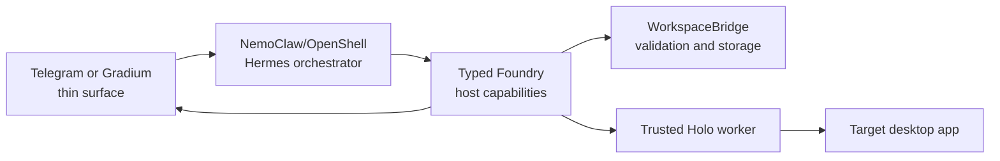

# Telegram/Gradium Hermes Orchestration Plan

## Status

Approved. Phase 1 was verified live on 2026-07-12 with NemoClaw 0.0.79, OpenShell 0.0.72, Hermes 0.17.0, and
`google/gemini-3.5-flash` through OpenRouter. The bounded SOP fixture produced a schema-valid unapproved bundle through
the authenticated upload transport after host validation rejected and prompted correction of an unsafe first draft.

The previous OpenClaw transport proposal was superseded on 2026-07-12. NemoClaw/Hermes is now the single orchestrator;
Telegram and Gradium are thin input surfaces, NemoClaw/Hermes is the orchestrator, and the Foundry host service is a
typed capability and privilege boundary.

## Outcome

Add owner-only surfaces that can submit a demonstration video or voice command, receive background authoring progress,
approve a reusable automation, collect schema-derived runtime inputs, start a run, and approve or reject the staged
desktop change. Hermes handles conversation and orchestration. The trusted host validates every request and remains the
only component allowed to publish skills or invoke HoloDesktop.

Surface adapters forward turns only to the authenticated Hermes gateway and never call a provider or surface-owned
model. NemoClaw never receives macOS Accessibility privileges. Hermes can request a Holo run through typed host tools,
but cannot bypass approval, validation, state-machine, hash, or same-session checks.

## Existing NemoClaw assets to reuse

- NemoClaw's stock managed Hermes image remains the canonical sandbox image.
- `nemoclaw/policies/hai-agent-platform.yaml` remains the canonical H Company egress policy.
- The sandbox name remains `hai-hermes` unless an onboarded installation explicitly uses another name.
- `WorkspaceBridge`, `HermesClientConfig`, and `BundleGenerator` remain the authoring path.
- The existing FastAPI services, bundle store, run state machine, and Holo worker become typed host capabilities rather
  than a competing orchestrator.
- `nemoclaw/README.md` remains the Foundry-specific onboarding, health, recovery, and teardown guide.

The upload transport is the preferred workspace path on this machine. Native macFUSE mounting was also proven but is
not required by the application.

## Phase 1 — Activate and verify NemoClaw/Hermes

Status: complete.

### Verified result

- `hai-hermes` was onboarded from NemoClaw's managed Hermes image.
- The H Company egress policy and loopback Hermes API forward were verified.
- The selected workspace transport satisfies `WorkspaceBridge` readiness and bounded publication checks.
- A real fixture generated a schema-valid unapproved bundle through Hermes inside NemoClaw.
- Workspace loss, malformed generation, and unsafe persistent steps fail closed.
- No direct host-model fallback exists.

Relevant gates: authoring sections 3.2–3.4, sandbox/privacy sections 3.8–3.10, and the NemoClaw manual preflight in
`EVALS.md` section 5.1.

## Phase 2 — Typed Hermes host capabilities

Status: first read-only slice complete. `foundry_health` and `get_authoring_status` passed deterministic tests and a live
Gemini 3.5 Flash → Hermes → MCP mailbox → trusted host worker round trip on 2026-07-12. Mutating capabilities remain
unimplemented.

### Objective

Expose the smallest capability-limited interface that lets Hermes request deterministic host operations without gaining
host privileges. Begin with authoring status and bounded demonstration ingestion, then add approval and execution in
later slices. Automated tests use fake authoring and execution services before any live provider or desktop effects.

### Likely changes

- `src/automation_foundry/contracts/models.py` — strict caller, capability request, callback, and delivery contracts.
- `src/automation_foundry/orchestration/` — typed capability service, authorization, idempotency, and safe presentations.
- `src/automation_foundry/api.py` — loopback-only capability router registration.
- `src/automation_foundry/settings.py` — dedicated capability authentication and non-secret surface settings.
- `tests/orchestration/` — sender, idempotency, expiry, replay, hash-binding, and backend failure tests.

### Acceptance criteria

- Requests are authenticated and capability-scoped before media copy or state lookup.
- The interface exposes typed operations rather than arbitrary URLs, shell commands, file paths, or Python execution.
- Duplicate request IDs are idempotent and conflicting replays fail closed.
- Authoring refuses to start when the NemoClaw workspace/Hermes boundary is not configured.
- Hermes and the host receive only safe identifiers and redacted errors; no credential or local path is returned.
- The host remains authoritative for validation, storage, approval state, and Holo dispatch.

## Phase 3 — Thin Telegram and Gradium surfaces

### Objective

Implement owner-only Telegram polling/media/buttons and connect Gradium voice to the same Hermes conversation. Telegram
supplies media and buttons; Gradium supplies final transcripts and response audio. Neither surface owns reasoning or
privileged host operations. The Telegram adapter exists because Hermes 0.17.0's public plugin API cannot register custom
Telegram callbacks; it forwards all conversation turns to Hermes and consumes Foundry buttons directly on the host.

### Acceptance criteria

- Non-allowlisted Telegram senders are rejected before media copy or state lookup; groups are disabled.
- Partial Gradium transcripts never request a capability or imply approval.
- One accepted Telegram update creates exactly one interaction and one media handoff.
- Duplicate and out-of-order updates are idempotent.
- The Telegram token remains outside the repository and enters only the thin transport process, never model context,
  NemoClaw, Foundry host capabilities, Holo, logs, responses, or fixtures.
- Channel or voice failures do not mutate authoring or run state.

## Phase 4 — Hermes-backed authoring and review

### Objective

Connect a surface-submitted demonstration to existing upload validation, preprocessing, `WorkspaceBridge`,
NemoClaw/Hermes/Holo3 generation, host validation, and progress. Hermes presents the validated result and schema-derived
review details through the active surface.

### Acceptance criteria

- Dashboard and surface videos produce equivalent canonical evidence and bundle structure.
- Every job creates an observable NemoClaw workspace request and bounded, schema-validated Hermes result.
- Lost transport, unavailable Hermes/Holo3, malformed output, and interrupted jobs fail closed without fallback.
- Blocking conflicts and validation failures never expose an approval action.
- Background progress and terminal failure remain queryable after delivery interruptions.

## Phase 5 — Deterministic automation approval

### Objective

Render the version, semantic procedure, input schema, completion checks, commit boundary, and conflicts. Approve only a
validation-clean version through a host-minted **Approve automation** callback.

### Acceptance criteria

- Callbacks are opaque, short-lived, one-time, identity-bound, chat-bound, action-bound, and artifact-hash-bound.
- Text, model output, captions, reactions, duplicate updates, and callback-like strings never imply approval.
- Edits invalidate previous controls and require a refreshed version.
- Replay, expiry, wrong identity/chat, and hash mismatch cannot publish a skill.

## Phase 6 — Runtime inputs and Holo staging

### Objective

Hermes selects the approved automation, collects target app and schema-derived runtime inputs, and requests a complete
preview. A deterministic **Start** callback enters the existing run state machine. The trusted host Holo worker stages
the change without saving.

### Acceptance criteria

- Missing or invalid inputs receive field-specific prompts and never start Holo.
- Preview callbacks bind automation version, target, normalized inputs, and budgets.
- Concurrent-run, inactive-bundle, and hash-mismatch checks match dashboard behavior.
- Hermes requests Holo through the typed host capability; neither Hermes nor a surface has desktop permissions.

## Phase 7 — Commit approval, live verification, and handoff

### Objective

Present the staged-change summary with separate **Commit** and **Reject** buttons. A valid commit continues only the
existing Holo session. Then run the live Telegram/Gradium walkthrough and document startup, shutdown, recovery, token
rotation, and deletion.

### Acceptance criteria

- No persistent mutation occurs before commit approval.
- Reject, timeout, cancel, replay, session loss, and wrong staged-change hash never dispatch commit.
- Successful commit uses the same session and reports exact visible verification.
- All backend and surface checks, `git diff --check`, and secret/runtime-artifact inspection pass.
- NemoClaw transport loss, Telegram outage, approval timeout, Holo session loss, and kill-switch trials pass.

## User-managed setup

- The user creates the Telegram bot in BotFather and stores its token in a user-managed environment value or token file
  outside the repository. The token is never pasted into chat or committed.
- The user pairs or configures the numeric Telegram owner ID during the live setup step.

## Deferred

- Telegram groups or multiple operators.
- WhatsApp and other messaging surfaces.
- Public webhooks, cloud-hosted Foundry, scheduling, and unattended execution.
- Durable restart-resuming ingestion beyond the explicit-retry policy.
